# 📐 ARCHITECTURE TECHNIQUE - APPLICATION ANDROID TV PLEXHUB
**Document d'Architecture Logiciel Détaillé**  
**Date:** 17 Janvier 2026  
**Application:** PlexHub - Agrégateur Plex pour Android TV  
**Langage:** Kotlin (100%)  
**Framework UI:** Jetpack Compose for TV  

---

## 📋 RÉSUMÉ EXÉCUTIF (5-10 lignes)

**PlexHub** est une application Android TV moderne écrite **100% en Kotlin** utilisant **Jetpack Compose for TV** pour l'interface utilisateur. L'architecture suit le pattern **MVVM avec Coroutines Flow** pour la réactivité, **Hilt** pour l'injection de dépendances, **Room** pour la persistance locale et **ExoPlayer** pour la lecture vidéo. L'application consomme une API REST FastAPI centralisée exposant des films/séries Plex avec support de la pagination, du filtrage, de la recherche et des favoris. La navigation est gérée par Compose, optimisée pour les écrans 10 pieds avec gestion D-pad et focus visuel. Le code est organisé en couches : **UI (Screens/Composables) → ViewModel (Logique État) → Repository (Abstraction Données) → DataSource (API/DB)**, avec un **SyncWorker** pour la synchronisation périodique (6h) et un **ExoPlayerManager** centralisant la gestion du lecteur.

---

## 1. VUE D'ENSEMBLE DE L'APPLICATION ANDROID TV

### 1.1 Rôle Global et Fonctionnalités

L'application **PlexHub** offre une expérience de navigation et de lecture de contenu Plex optimisée pour **Android TV** (écrans 43"+, télécommande D-pad). Elle agit comme **client riche** consommant une API backend REST pour :

- **Browse & Discover** : Accès à une médiathèque complète (films + séries)
- **Filtrage & Tri** : Par genre, type, note, année, date d'ajout
- **Recherche** : Recherche textuelle en temps réel
- **Favorites** : Sauvegarde locale des contenus aimés
- **Playback** : Lecture vidéo avec ExoPlayer, reprise de lecture, historique
- **Settings** : Configuration des préférences (tri par défaut, URL serveur)
- **Server Discovery** : Découverte et gestion des serveurs Plex (UI existante)

### 1.2 Écrans Principaux

| Écran | Composable | ViewModel | Rôle |
|-------|-----------|-----------|------|
| **Home/Browse** | `HomeScreen` | `HomeViewModel` | Grille pageable, filtrage, tri, recherche |
| **Detail** | `DetailScreen` | `DetailViewModel` | Fiche détail film/série, seasons, sources |
| **Playback** | `PlayerScreen` | `PlayerViewModel` | Lecteur vidéo fullscreen ExoPlayer |
| **Favorites** | `FavoritesScreen` | (Simple) | Liste contenus favorialisés |
| **Search** | `SearchScreen` | (Simple) | Recherche dédiée |
| **Servers** | `ServersScreen` | `ServerViewModel` | Gestion serveurs |
| **ServerDiscovery** | `ServerDiscoveryScreen` | `ServerDiscoveryViewModel` | Découverte mDNS |
| **Settings** | `SettingsScreen` | `SettingsViewModel` | Préférences utilisateur |

### 1.3 Diagramme de Navigation (Mermaid)

```mermaid
graph TD
    A["MainActivity<br/>(Compose Host)"] -->|NavGraph| B["HomeScreen"]
    B -->|Click Movie| C["DetailScreen"]
    C -->|Click Play| D["PlayerScreen"]
    D -->|Back| C
    C -->|Back| B
    B -->|Tab| E["FavoritesScreen"]
    B -->|Tab| F["SearchScreen"]
    B -->|Tab| G["ServersScreen"]
    B -->|Tab| H["SettingsScreen"]
    G -->|Discover| I["ServerDiscoveryScreen"]
    H -.->|Preferences| J["PreferencesManager<br/>DataStore"]
    B -.->|Filter/Sort| K["HomeViewModel<br/>Coroutines Flow"]
    C -.->|Detail Data| L["DetailViewModel"]
    D -.->|ExoPlayer| M["ExoPlayerManager"]
    K -.->|Media Data| N["MediaRepository"]
    L -.->|Favorites| O["FavoriteRepository"]
    N -.->|Cache/Sync| P["AppDatabase<br/>Room"]
    N -.->|Network| Q["MovieApiService<br/>Retrofit"]
    style A fill:#FF6B35
    style B fill:#004E89
    style C fill:#1B6CA8
    style D fill:#2B2D42
    style Q fill:#F77F00
```



---

## 2. STACK TECHNOLOGIQUE ANDROID

### 2.1 Configuration Gradle et Versions

**Fichier:** `build.gradle.kts`

```kotlin
android {
    namespace = "com.chakir.aggregatorhubplex"
    compileSdk = 34

    defaultConfig {
        applicationId = "com.chakir.aggregatorhubplex"
        minSdk = 25
        targetSdk = 34
        versionCode = 1
        versionName = "1.0.0"
    }
    // ...
}
```

### 2.2 Langage Utilisé

- **Kotlin 100%** (aucun fichier Java)

### 2.3 Frameworks et Bibliothèques Clés

#### UI & Compose (TV)
- Jetpack Compose (foundation, material3)
- **androidx.tv:tv-material3** (composants TV)
- Coil (chargement d'images `AsyncImage`)

#### Architecture & State
- ViewModel (`lifecycle-viewmodel-ktx`)
- Coroutines + Flow/StateFlow
- Paging 3 (`paging-compose`)

#### DI & Background
- Hilt (`hilt-android`, `hilt-navigation-compose`, `hilt-work`)
- WorkManager (`work-runtime-ktx`)

#### Données & Réseau
- Room (`room-runtime`, `room-ktx`, `room-compiler`)
- DataStore Preferences
- Retrofit + OkHttp + logging-interceptor
- kotlinx.serialization + converter Kotlinx

#### Player
- ExoPlayer / Media3 (`media3-exoplayer`, `media3-ui`)

---

## 3. ARCHITECTURE LOGIQUE

### 3.1 Structure des Packages

```text
com.chakir.aggregatorhubplex
├── MyApplication.kt
├── MainActivity.kt
├── ui/
│   ├── screens/
│   │   ├── HomeScreen.kt / HomeViewModel.kt
│   │   ├── DetailScreen.kt / DetailViewModel.kt
│   │   ├── PlayerScreen.kt / PlayerViewModel.kt
│   │   ├── FavoritesScreen.kt
│   │   ├── SearchScreen.kt
│   │   ├── ServersScreen.kt / ServerViewModel.kt
│   │   ├── ServerDiscoveryScreen.kt / ServerDiscoveryViewModel.kt
│   │   ├── SettingsScreen.kt / SettingsViewModel.kt
│   │   └── Screen.kt (routing/sealed class)
│   ├── components/
│   │   ├── HeroBanner.kt
│   │   ├── FilterBar.kt
│   │   ├── SortMenu.kt
│   │   ├── SkeletonCard.kt
│   │   ├── FeaturedCarousel.kt
│   │   └── AppSidebar.kt
│   └── theme/
│       └── Dimens.kt
├── data/
│   ├── DataLayer.kt (DTOs, models, UrlFixer, MovieApiService)
│   ├── Resource.kt
│   ├── local/
│   │   ├── AppDatabase.kt
│   │   ├── MovieEntity.kt, MovieFtsEntity.kt
│   │   ├── MovieDao.kt
│   │   ├── FavoriteEntity.kt, FavoriteDao.kt
│   │   ├── PlayHistoryEntity.kt, PlayHistoryDao.kt
│   │   └── Converters.kt
│   ├── repository/
│   │   ├── MediaRepository.kt / MediaRepositoryImpl.kt
│   │   ├── FavoriteRepository.kt
│   │   ├── PlayHistoryRepository.kt
│   │   └── ServerRepository.kt
│   ├── preferences/
│   │   └── PreferencesManager.kt
│   └── di/
│       ├── ApiModule.kt
│       ├── DatabaseModule.kt
│       ├── RepositoryModule.kt
│       ├── PreferencesModule.kt
│       └── DispatcherModule.kt
├── player/
│   └── ExoPlayerManager.kt
└── workers/
    └── SyncWorker.kt
```

### 3.2 Pattern Global

- **MVVM** : UI (Compose) → ViewModel → Repository → DataSource (API/DB)
- **Repository pattern** pour séparer logique d'accès aux données
- **Flow/StateFlow** pour les états réactifs (UI subscribe)
- **DI Hilt** pour instancier repositories, DAO, ApiService, ExoPlayerManager, etc.

Schéma logique :

```text
UI (Composable Screens)
   ↓ observe StateFlow/Flow
ViewModels (Home, Detail, Player, ...)
   ↓ appellent
Repositories (Media, Favorite, PlayHistory, Server)
   ↓ orchestrent
Data Sources
   ├── Local: Room (MovieDao, FavoriteDao, PlayHistoryDao)
   └── Remote: Retrofit (MovieApiService)
```

### 3.3 Exemple: HomeViewModel

```kotlin
@HiltViewModel
class HomeViewModel @Inject constructor(
    private val repository: MediaRepository,
    private val preferencesManager: PreferencesManager
) : ViewModel() {

    private val _searchQuery = MutableStateFlow<String?>(null)
    private val _filterType = MutableStateFlow<String?>(null)
    private val _sortOption = MutableStateFlow(SortOption.ADDED_DESC)
    private val _filterGenreLabel = MutableStateFlow("Tout")

    val currentFilterType = _filterType.asStateFlow()
    val currentSortOption = _sortOption.asStateFlow()
    val currentSearchQuery = _searchQuery.asStateFlow()
    val currentFilterGenre = _filterGenreLabel.asStateFlow()
    val genreLabels: List<String> = GenreGrouping.UI_LABELS

    init {
        viewModelScope.launch {
            val savedSort = preferencesManager.sortOption.first()
            _sortOption.value = SortOption.fromString(savedSort)
        }
    }

    @OptIn(ExperimentalCoroutinesApi::class)
    val featuredMovies: StateFlow<List<Movie>> = currentFilterType
        .flatMapLatest { type ->
            val limit = if (type == "show") 30 else 20
            repository.getTopRated(type, limit)
        }
        .map { it.shuffled().take(5) }
        .stateIn(viewModelScope, SharingStarted.WhileSubscribed(5000), emptyList())

    @OptIn(ExperimentalCoroutinesApi::class)
    val totalCount: StateFlow<Int> = combine(
        _searchQuery, _filterType, _filterGenreLabel
    ) { query, type, genre -> Triple(query, type, genre) }
        .flatMapLatest { (query, type, genre) ->
            repository.getFilteredCount(query, type, genre)
        }
        .stateIn(viewModelScope, SharingStarted.WhileSubscribed(5000), 0)

    @OptIn(ExperimentalCoroutinesApi::class)
    val moviesPagingFlow: Flow<PagingData<Movie>> = combine(
        _searchQuery, _filterType, _filterGenreLabel, _sortOption
    ) { query, type, genreLabel, sortOpt ->
        QueryConfig(query, type, genreLabel, sortOpt)
    }.flatMapLatest { config ->
        repository.getMediaPaged(
            search = config.query,
            type = config.type,
            genreLabel = config.genreLabel,
            sort = config.sortOpt
        )
    }.cachedIn(viewModelScope)

    fun onTypeChange(type: String) {
        _filterType.value = if (type == "all") null else type
    }

    fun onSortChange(option: SortOption) {
        _sortOption.value = option
        viewModelScope.launch {
            preferencesManager.setSortOption(option.name)
        }
    }

    fun onSearchChange(query: String) {
        _searchQuery.value = query.ifBlank { null }
    }

    fun onGenreChange(genreLabel: String) {
        _filterGenreLabel.value = genreLabel
    }
}
```

---

## 4. NAVIGATION ET ÉCRANS TV

### 4.1 HomeScreen

```kotlin
@OptIn(ExperimentalTvMaterial3Api::class)
@Composable
fun HomeScreen(
    onMovieClick: (Movie) -> Unit,
    viewModel: HomeViewModel = hiltViewModel()
) {
    val movies = viewModel.moviesPagingFlow.collectAsLazyPagingItems()
    val featuredMovies by viewModel.featuredMovies.collectAsState()
    val totalCount by viewModel.totalCount.collectAsState()
    val genreLabels = viewModel.genreLabels

    var isSortMenuOpen by remember { mutableStateOf(false) }
    val currentSort by viewModel.currentSortOption.collectAsState()
    val currentGenre by viewModel.currentFilterGenre.collectAsState()
    val currentType by viewModel.currentFilterType.collectAsState()

    val gridState = rememberLazyGridState()
    var filterVersion by remember { mutableIntStateOf(0) }
    val sortMenuFocusRequester = remember { FocusRequester() }

    val plexColor = Color(0xFFE5A00D)
    val plexBackgroundColor = Brush.verticalGradient(
        colors = listOf(Color(0xFF282828), Color(0xFF141414))
    )

    LaunchedEffect(isSortMenuOpen) {
        if (isSortMenuOpen) {
            sortMenuFocusRequester.requestFocus()
        }
    }

    LaunchedEffect(filterVersion) {
        if (filterVersion > 0) gridState.scrollToItem(0)
    }

    val displayTitle = when (currentType) {
        "movie" -> "Films"
        "show" -> "Séries"
        else -> "Médiathèque"
    }

    Box(
        modifier = Modifier
            .fillMaxSize()
            .background(plexBackgroundColor)
    ) {
        LazyVerticalGrid(
            state = gridState,
            columns = GridCells.Adaptive(minSize = 120.dp),
            verticalArrangement = Arrangement.spacedBy(Dimens.spacing_xl),
            horizontalArrangement = Arrangement.spacedBy(Dimens.spacing_l),
            contentPadding = PaddingValues(
                bottom = Dimens.spacing_xxxl,
                start = Dimens.spacing_xxxl,
                end = Dimens.spacing_xxxl
            ),
            modifier = Modifier.fillMaxSize()
        ) {
            // Gestion état loading / skeletons / erreurs
            // HeroBanner + FilterBar + SortMenu + grille MovieCard(...)
        }
    }
}
```

Gestion du focus & D-pad :
- `Surface` avec `focusable(interactionSource)`
- Animation de scale + border blanche en cas de focus
- `FocusRequester` pour forcer le focus sur certains éléments (menu de tri)

### 4.2 DetailScreen

- Affiche le détail d'un `Movie` (film ou série)
- Gère favoris via `FavoriteRepository`
- Récupère les données via `MediaRepository.getMovieDetail(id)` (cache + réseau)

```kotlin
@HiltViewModel
class DetailViewModel @Inject constructor(
    private val mediaRepository: MediaRepository,
    private val favoriteRepository: FavoriteRepository
) : ViewModel() {

    private val _movie = MutableStateFlow<Movie?>(null)
    val movie: StateFlow<Movie?> = _movie

    private val _isLoading = MutableStateFlow(true)
    val isLoading: StateFlow<Boolean> = _isLoading

    private val _isFavorite = MutableStateFlow(false)
    val isFavorite: StateFlow<Boolean> = _isFavorite

    private var dataJob: Job? = null
    private var favoriteJob: Job? = null

    fun loadMovie(movieId: String) {
        dataJob?.cancel()
        favoriteJob?.cancel()

        favoriteJob = viewModelScope.launch {
            favoriteRepository.isFavorite(movieId).collectLatest { isFav ->
                _isFavorite.value = isFav
            }
        }

        dataJob = viewModelScope.launch {
            mediaRepository.getMovieDetail(movieId).collectLatest { movieData ->
                if (movieData != null) {
                    _isLoading.value = false
                    _movie.value = movieData
                }
            }
        }
    }

    fun toggleFavorite() {
        val currentMovie = _movie.value ?: return
        viewModelScope.launch {
            if (_isFavorite.value) {
                favoriteRepository.removeFromFavorites(currentMovie.id)
            } else {
                favoriteRepository.addToFavorites(currentMovie)
            }
        }
    }
}
```

### 4.3 PlayerScreen & PlayerViewModel

```kotlin
@OptIn(UnstableApi::class)
@HiltViewModel
class PlayerViewModel @Inject constructor(
    private val playerManager: ExoPlayerManager,
    private val historyRepository: PlayHistoryRepository
) : ViewModel() {

    val player = playerManager.getPlayer()

    private var currentMediaId: String = ""
    private var currentTitle: String = "Unknown"

    fun playMedia(url: String) {
        currentMediaId = url
        viewModelScope.launch {
            val savedPosition = historyRepository.getPlaybackPosition(currentMediaId)
            playerManager.play(url)
            if (savedPosition > 0) {
                player.seekTo(savedPosition)
            }
        }
    }

    private fun saveProgress() {
        if (currentMediaId.isNotEmpty() && player.duration > 0) {
            val position = player.currentPosition
            val duration = player.duration
            viewModelScope.launch {
                historyRepository.savePlaybackPosition(
                    mediaId = currentMediaId,
                    title = "Vidéo",
                    posterUrl = null,
                    positionMs = position,
                    durationMs = duration
                )
            }
        }
    }

    fun pause() {
        saveProgress()
        playerManager.pause()
    }

    override fun onCleared() {
        super.onCleared()
        saveProgress()
    }
}
```

```kotlin
@OptIn(UnstableApi::class)
@Composable
fun PlayerScreen(
    streamUrl: String,
    mediaTitle: String = "Vidéo",
    mediaId: String = "",
    onBack: () -> Unit,
    viewModel: PlayerViewModel = hiltViewModel()
) {
    val context = LocalContext.current

    val decodedUrl = remember(streamUrl) {
        try { URLDecoder.decode(streamUrl, StandardCharsets.UTF_8.toString()) }
        catch (e: Exception) { streamUrl }
    }

    DisposableEffect(Unit) {
        val window = (context as? Activity)?.window
        if (window != null) {
            val insetsController = WindowCompat.getInsetsController(window, window.decorView)
            insetsController.systemBarsBehavior =
                WindowInsetsControllerCompat.BEHAVIOR_SHOW_TRANSIENT_BARS_BY_SWIPE
            insetsController.hide(WindowInsetsCompat.Type.systemBars())
        }
        onDispose {
            val window = (context as? Activity)?.window
            if (window != null) {
                val insetsController = WindowCompat.getInsetsController(window, window.decorView)
                insetsController.show(WindowInsetsCompat.Type.systemBars())
            }
            viewModel.pause()
        }
    }

    LaunchedEffect(decodedUrl) {
        viewModel.playMedia(url = decodedUrl)
    }

    Box(
        modifier = Modifier
            .fillMaxSize()
            .background(Color.Black)
    ) {
        AndroidView(
            modifier = Modifier.fillMaxSize(),
            factory = { ctx ->
                val inflater = LayoutInflater.from(ctx)
                val playerView = inflater.inflate(R.layout.view_player, null) as PlayerView
                playerView.player = viewModel.player
                playerView.keepScreenOn = true
                playerView
            }
        )
    }
}
```

---

## 5. MODÈLE DE DONNÉES, ROOM & PERSISTENCE

### 5.1 Entités Principales

```kotlin
@Entity(
    tableName = "movies",
    indices = [Index("title"), Index("addedAt"), Index("type")]
)
data class MovieEntity(
    @PrimaryKey val id: String,
    val title: String,
    val type: String,
    val posterUrl: String,
    val year: Int?,
    val rating: Float?,
    val imdbRating: Float?,
    val genres: List<String>?,
    val addedAt: String?,
    val hasMultipleSources: Boolean,
    val rottenRating: Int?,
    val director: String?,
    val description: String?,
    val studio: String?,
    val contentRating: String?,
    val servers: List<Server>?,
    val seasons: List<Season>?
)
```

```kotlin
@Entity(tableName = "favorites")
data class FavoriteEntity(
    @PrimaryKey val movieId: String,
    val addedAt: Long = System.currentTimeMillis()
)

@Entity(tableName = "play_history")
data class PlayHistoryEntity(
    @PrimaryKey val mediaId: String,
    val title: String,
    val posterUrl: String?,
    val positionMs: Long,
    val durationMs: Long,
    val watchedAt: Long = System.currentTimeMillis()
)
```

### 5.2 AppDatabase

```kotlin
@Database(
    entities = [
        MovieEntity::class,
        MovieFtsEntity::class,
        RemoteKeys::class,
        FavoriteEntity::class,
        PlayHistoryEntity::class
    ],
    version = 3,
    exportSchema = false
)
@TypeConverters(Converters::class)
abstract class AppDatabase : RoomDatabase() {

    abstract fun movieDao(): MovieDao
    abstract fun favoriteDao(): FavoriteDao
    abstract fun playHistoryDao(): PlayHistoryDao

    companion object {
        @Volatile
        private var INSTANCE: AppDatabase? = null

        fun getDatabase(context: Context): AppDatabase {
            return INSTANCE ?: synchronized(this) {
                val instance = Room.databaseBuilder(
                    context.applicationContext,
                    AppDatabase::class.java,
                    "plexhub_database"
                )
                    .fallbackToDestructiveMigration()
                    .build()
                INSTANCE = instance
                instance
            }
        }
    }
}
```

### 5.3 DataLayer & API

```kotlin
@Serializable
data class MovieListItem(
    val id: String,
    val title: String = "Sans titre",
    val type: String = "movie",
    val year: Int? = null,
    @SerialName("poster_url") val posterPath: String? = null,
    val rating: Float? = null,
    @SerialName("imdb_rating") val imdbRating: Float? = null,
    val hasMultipleSources: Boolean = false,
    val genres: List<String>? = emptyList(),
    @SerialName("added_at") val addedAt: String? = null
)

@Serializable
data class Movie(
    val id: String,
    val title: String = "Sans titre",
    val type: String = "movie",
    @SerialName("summary") val description: String? = "Aucune description disponible",
    val rating: Float? = null,
    @SerialName("genres") val genres: List<String>? = emptyList(),
    val director: String? = null,
    val studio: String? = null,
    @SerialName("content_rating") val contentRating: String? = null,
    @SerialName("imdb_rating") val imdbRating: Float? = null,
    @SerialName("rotten_rating") val rottenRating: Int? = null,
    @SerialName("added_at") val addedAt: String? = null,
    @SerialName("poster_url") val posterPath: String? = null,
    @SerialName("backdrop_url") val backdropPath: String? = null,
    val year: Int? = null,
    @SerialName("sources") val servers: List<Server>? = emptyList(),
    val seasons: List<Season>? = emptyList(),
    val hasMultipleSources: Boolean = false
) {
    val posterUrl: String get() = UrlFixer.fix(posterPath)
    val backdropUrl: String get() = UrlFixer.fix(backdropPath ?: posterPath)
    val isSeries: Boolean get() = type == "show"
}

@Serializable
data class Server(
    @SerialName("server_name") val name: String = "Inconnu",
    @SerialName("stream_url") val url: String = "",
    @SerialName("m3u_url") val rawM3uUrl: String? = null,
    @SerialName("resolution") val resolution: String? = "SD",
    @SerialName("plex_deeplink") val plexDeepLink: String? = null,
    @SerialName("plex_web_url") val plexWebUrl: String? = null
) {
    val m3uUrl: String? get() = rawM3uUrl?.let { fixUrl(it) }
    val streamUrl: String get() = fixUrl(url)

    private fun fixUrl(url: String): String = UrlFixer.fix(url)
}

interface MovieApiService {
    @GET("/api/movies")
    suspend fun getMovies(
        @Query("page") page: Int?,
        @Query("size") size: Int?,
        @Query("type") type: String?,
        @Query("sort") sort: String?,
        @Query("order") order: String?,
        @Query("search") search: String?
    ): List<MovieListItem>

    @GET("/api/movies/{id}")
    suspend fun getMovieDetail(@Path("id") id: String): Movie

    @GET("/api/movies/{id}/seasons")
    suspend fun getShowSeasons(@Path("id") id: String): List<Season>

    @GET("/api/servers")
    suspend fun getServerInfo(): List<ServerInfo>

    @POST("/api/refresh")
    suspend fun triggerRefresh(): ScanResponse
}
```

---

## 6. SYNC, WORKER ET BACKGROUND

```kotlin
@HiltAndroidApp
class MyApplication : Application(), Configuration.Provider {

    @Inject
    lateinit var workerFactory: HiltWorkerFactory

    override fun onCreate() {
        super.onCreate()
        setupPeriodicSync()
    }

    private fun setupPeriodicSync() {
        val workManager = WorkManager.getInstance(this)
        val constraints = Constraints.Builder()
            .setRequiredNetworkType(NetworkType.CONNECTED)
            .build()

        val syncRequest = PeriodicWorkRequestBuilder<SyncWorker>(
            6, TimeUnit.HOURS
        ).setConstraints(constraints).build()

        workManager.enqueueUniquePeriodicWork(
            "movie_sync_work",
            ExistingPeriodicWorkPolicy.KEEP,
            syncRequest
        )
    }

    override val workManagerConfiguration: Configuration
        get() = Configuration.Builder()
            .setWorkerFactory(workerFactory)
            .build()
}
```

```kotlin
@HiltWorker
class SyncWorker @AssistedInject constructor(
    @Assisted appContext: Context,
    @Assisted workerParams: WorkerParameters,
    private val movieDao: MovieDao,
    private val apiService: MovieApiService
) : CoroutineWorker(appContext, workerParams) {

    override suspend fun doWork(): Result = withContext(Dispatchers.IO) {
        return@withContext try {
            Log.i("SyncWorker", "🚀 Démarrage de la synchronisation...")
            syncAllContent()
            Log.i("SyncWorker", "✅ Synchronisation terminée avec succès !")
            Result.success()
        } catch (e: Exception) {
            Log.e("SyncWorker", "❌ Erreur de synchro: ${e.message}", e)
            if (runAttemptCount < 3) Result.retry() else Result.failure()
        }
    }

    private suspend fun syncAllContent() {
        var page = 1
        val pageSize = 500
        while (true) {
            Log.d("SyncWorker", "📥 Téléchargement de la page $page...")
            val response: List<MovieListItem> = try {
                apiService.getMovies(
                    page = page,
                    size = pageSize,
                    type = null,
                    sort = "added_at",
                    order = "desc",
                    search = null
                )
            } catch (e: Exception) {
                Log.e("SyncWorker", "Erreur réseau sur la page $page", e)
                throw e
            }

            if (response.isEmpty()) {
                Log.d("SyncWorker", "🏁 Fin de la pagination, plus de contenu à charger.")
                break
            }

            val entities = response.map { it.toEntity() }
            movieDao.upsertAll(entities)
            Log.d("SyncWorker", "💾 Page $page sauvegardée (${entities.size} items)")

            if (response.size < pageSize) {
                Log.d("SyncWorker", "🏁 Dernière page atteinte.")
                break
            }

            page++
        }
    }

    private fun MovieListItem.toEntity() = MovieEntity(
        id = id,
        title = title,
        type = type,
        posterUrl = UrlFixer.fix(posterPath),
        year = year,
        rating = rating,
        imdbRating = imdbRating,
        genres = genres,
        addedAt = addedAt,
        hasMultipleSources = hasMultipleSources,
        rottenRating = null,
        director = null,
        description = null,
        studio = null,
        contentRating = null,
        servers = null,
        seasons = null
    )
}
```

---

## 7. SÉCURITÉ, QUALITÉ, UX TV & RISQUES

### 7.1 Sécurité
- Pas d'authentification utilisateur dans le code Android (LAN trust)
- Aucune gestion de token/refresh côté app visible
- Sanitisation & normalisation des URLs via `UrlFixer`

### 7.2 Qualité & Tests
- Patterns et DI rendent le code testable (ViewModels, Repositories)
- Tests non visibles dans les sources fournies → **Non déterminable** pour la couverture

### 7.3 UX TV & Accessibilité
- 10-foot UI: gros textes, fortes marges, contrastes élevés
- Focus visuel clair (zoom, bordure blanche)
- Support complet D-pad pour navigation
- `contentDescription` pour les images (TalkBack)

### 7.4 Limites & Risques Identifiés

- **Couplage UI/Logique** dans certains ViewModels (filtrage, tri)
- **Sync complet** à chaque exécution (pas d'incrémental)
- **Cache invvalidation** non gérée finement (TTL, mode offline)
- **Pas d'authentification** → OK pour LAN, risqué si exposé public
- **ExoPlayerManager** non explicitement `release()` dans le code visible → risque mineur de fuite si multiple activités

---

## 8. CONCLUSION

L'application Android TV **PlexHub** repose sur une architecture **moderne, propre et bien structurée**, alignée avec les bonnes pratiques Android actuelles (Kotlin, Compose, MVVM, Hilt, Room, ExoPlayer). Elle est particulièrement adaptée à une utilisation sur TV (navigation D-pad, focus, 10-foot UI) et intègre un backend FastAPI exposant un catalogue Plex.

Le document ci-dessus décrit l'état **réel** du code analysé, sans ajouter de fonctionnalités non présentes. Toute extrapolation est marquée explicitement comme **hypothèse**.
